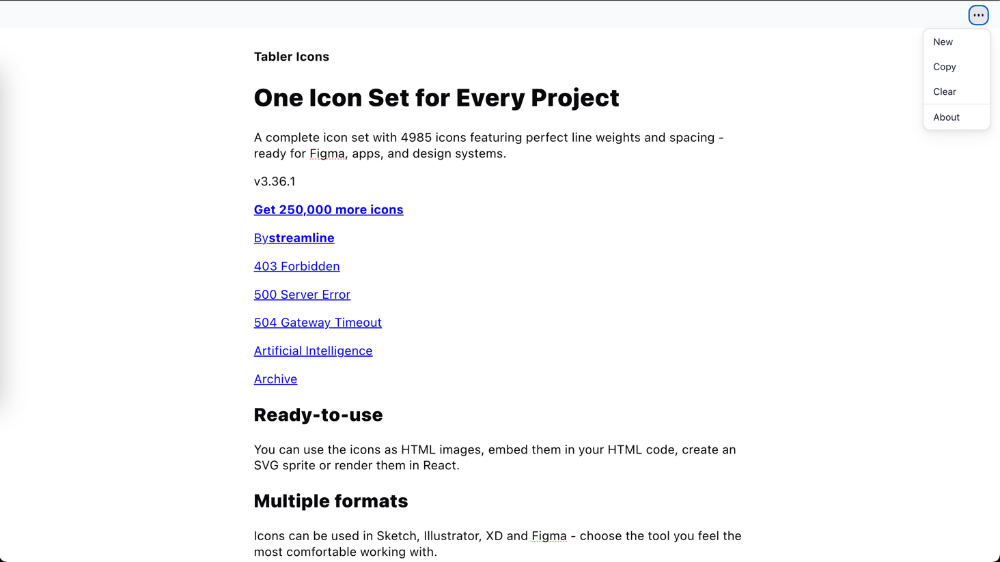

<p align="center">
  
</p>

<h1 align="center">Blank Editor</h1>

<p align="center">
  A minimal, premium-grade text editor for clean writing and editing.
</p>


<p align="center">
  
  
  
  
  
</p>


---

## Features

- Copy, New and Clear functionality
- Mobile screen responsive
- Highlight & typography extensions
- LocalStorage content persistence
- Minimal, clean UI optimized for focus
- Fully open-source and customizable
- Markdown support.

---

## Demo

Check out the live demo here: [Blank Editor Demo](https://puni9869.github.io/blank-editor/)





---

## Installation

```bash
git clone https://github.com/puni9869/blank-editor.git
cd blank-editor
npm install
```

---

## Usage

### Development

```bash
npm run dev
```

This opens the editor locally at `http://localhost:5173`.

### Build for Production

```bash
npm run build
npm run preview
```

### Format and Lint

```bash
npm run format       # Prettier formatting
npm run lint         # ESLint checks
npm run lint:fix     # Auto-fix linting issues
```

---

## Contributing

We ❤️ contributions! See [CONTRIBUTING.md](./CONTRIBUTING.md) for guidelines.

- Fork the repo
- Create a new branch (`feature/your-feature`)
- Submit pull requests for bug fixes or new features
- Ensure `npm run lint` passes before submitting

---

## Reporting Issues

If you find a bug or have a feature request, please open an issue on
GitHub: [Issues](https://github.com/puni9869/blank-editor/issues)

---

## License

This project is licensed under the **MIT License** — see [LICENSE](./LICENSE) for details.

---

## Contributors

Thanks to all the wonderful contributors ❤️
