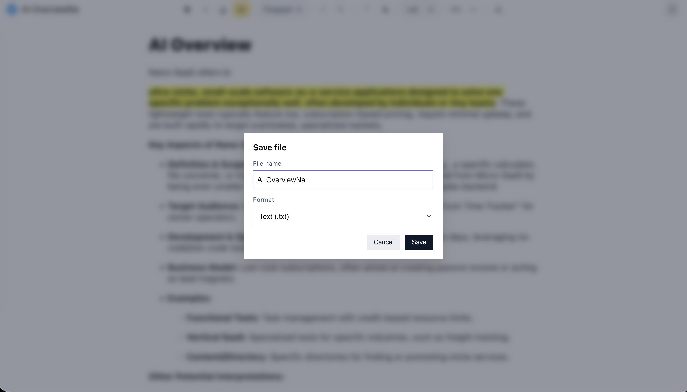

<p align="center">
  
</p>

<h1 align="center">Blank Editor</h1>

<p align="center">
    A minimal, premium-grade AI-powered text editor for clean writing and intelligent editing.
</p>

<p align="center">
  
  
  
  
  
</p>

---

## ✨ Features

### 🧠 AI-Powered Writing Assistance

- Smart content refinement and clarity improvement.
- Built with TipTap + ProseMirror
- Formatting: bold, italic, underline, strikethrough, highlight
- Headings (H1-H5), bullet/ordered lists, blockquote, code block, divider
- Text alignment controls: left, center, right, justify
- Journal block support

### 💾 Note Persistence

- Auto-save editor content and title in `localStorage`
- Save and manage notes in IndexedDB
- Search and reopen saved notes from the "All Notes"

### ⚡ Productivity

- Keyboard shortcuts for save, notes, fullscreen, and quick new page
- Fullscreen mode
- Minimal interface with responsive layout
- Toast feedback for editor actions

### 📦 Standalone Binary

- Single self-contained Go binary with embedded frontend and assets
- No external files or dependencies needed at runtime
- Configurable via CLI flags or environment variables
- Graceful shutdown, security headers, smart caching

---

## Demo

Check out the live demo here: [Blank Editor Demo](https://puni9869.github.io/blank-editor/)

### Screenshots





---

## Installation

### Prerequisites

- [Node.js](https://nodejs.org/) >= 18.18.0
- [pnpm](https://pnpm.io/) (via corepack or `npm install -g pnpm`)
- [Go](https://go.dev/) >= 1.26 (for the standalone server)

### Setup

```bash
git clone https://github.com/puni9869/blank-editor.git
cd blank-editor
corepack enable
pnpm install
```

> If `corepack` is unavailable, install pnpm globally with `npm install -g pnpm`.

---

## Usage

### Frontend Development

```bash
pnpm dev              # Vite dev server at http://localhost:5173
make watch-frontend   # Same, via Makefile
```

### Build Frontend

```bash
pnpm build            # Outputs to dist/
pnpm preview          # Preview the production build
```

### Go Server (Standalone Binary)

The Go server embeds the frontend build (`dist/`) and static assets (`assets/`) into a single self-contained binary.

```bash
make build            # Builds frontend + Go binary → build/blank-editor
make production       # Same, with CGO_ENABLED=0, trimpath, and git version tag
make run              # Build and start the server
```

Run the binary directly:

```bash
./build/blank-editor start                        # http://0.0.0.0:8080
./build/blank-editor start --port 3000            # Custom port
./build/blank-editor start --host 127.0.0.1       # Bind to localhost only
```

All flags are also configurable via environment variables:

| Flag | Env Var | Default |
|------|---------|---------|
| `--host` | `BLANK_EDITOR_HOST` | `0.0.0.0` |
| `--port` | `BLANK_EDITOR_PORT` | `8080` |
| `--read-timeout` | `BLANK_EDITOR_READ_TIMEOUT` | `15s` |
| `--write-timeout` | `BLANK_EDITOR_WRITE_TIMEOUT` | `15s` |
| `--idle-timeout` | `BLANK_EDITOR_IDLE_TIMEOUT` | `60s` |
| `--shutdown-timeout` | `BLANK_EDITOR_SHUTDOWN_TIMEOUT` | `10s` |

### Format and Lint

```bash
pnpm format       # Prettier formatting
pnpm lint         # ESLint checks
pnpm lint:fix     # Auto-fix linting issues
make fmt          # Go formatting
make vet          # Go vet
make lint         # golangci-lint
```

---

## Project Structure

```
├── assets/              # Static assets (favicons, robots.txt, sitemap)
├── cmd/                 # Go CLI entry point and commands
│   ├── main.go
│   └── command/
├── frontend/            # Frontend source (vanilla JS + TipTap)
│   ├── components/
│   ├── config/
│   ├── css/
│   ├── db/
│   ├── lib/
│   ├── plugins/
│   └── types/
├── server/              # Go HTTP server (routes, middleware, lifecycle)
│   ├── routes.go
│   ├── middleware.go
│   └── server.go
├── pkg/                 # Shared Go packages (logger, render)
├── templates/           # Go HTML templates
├── embed.go             # Embeds dist/ and assets/ into the binary
├── index.html           # Frontend entry point
└── vite.config.js       # Vite build configuration
```

---

## Deployment

### GitHub Pages

Pushes to `main` automatically build and deploy the frontend to GitHub Pages via the `static.yml` workflow.

Live demo: [https://puni9869.github.io/blank-editor/](https://puni9869.github.io/blank-editor/)

### Go Binary Releases

Tagging a release (`v*`) triggers the `release.yml` workflow, which builds cross-platform binaries (linux/darwin/windows, amd64/arm64) and uploads them as GitHub release assets.

---

## Contributing

We ❤️ contributions! See [CONTRIBUTING.md](./CONTRIBUTING.md) for guidelines.

- Fork the repo
- Create a new branch (`feature/your-feature`)
- Submit pull requests for bug fixes or new features
- Ensure `pnpm lint` passes before submitting

---

## Reporting Issues

If you find a bug or have a feature request, please open an issue on
GitHub: [Issues](https://github.com/puni9869/blank-editor/issues)

---

## License

This project is licensed under the **MIT License** — see [LICENSE](./LICENSE) for details.

---

## Contributors

Thanks to all the wonderful contributors ❤️
